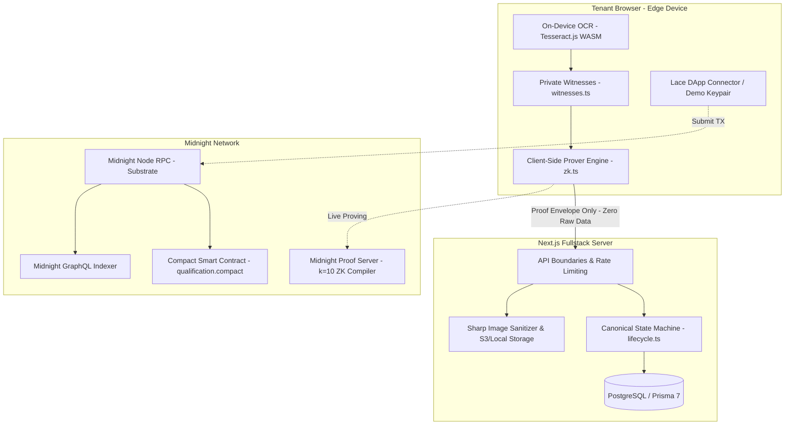

# ZkRent

> **Prove you can afford the rent without revealing your salary, tax returns, W-2 forms, bank statements, or Social Security number.**

ZkRent is a privacy-first rental application and qualification platform powered by the **Midnight Network** and Zero-Knowledge (ZK) proofs.

[](./LICENSE)
[](https://nextjs.org/)
[](https://midnight.network)


## LINK TO PREVIEW VIDEO

https://vimeo.com/1222486300?fl=ip&fe=ec
---

## 🎯 Executive Overview & The Problem

Traditional rental applications require tenants to disclose sensitive financial documents to prospective landlords—often including unredacted bank records, pay stubs, employer contacts, and SSNs.

This creates severe vulnerabilities for both parties:
1. **For Tenants**: Severe risk of identity theft, data breaches, discrimination, and loss of privacy.
2. **For Landlords & Property Managers**: Catastrophic compliance exposure (GDPR, CCPA, PII liability) and the risk of holding unencrypted consumer financial data.

A landlord legitimately needs to know:
> *"Does this applicant satisfy my requirement of earning at least 3× the rent with a clean background check?"*

Under the legacy model, answering that simple question requires total document surrender.

### The ZkRent Paradigm Shift
**Landlords need verification, not data custody.**

```text
┌──────────────────────────────────────────────────────────┐
│                   TRADITIONAL MODEL                      │
│ Tenant Data ──────> Landlord Database ──────> Inspection │
│ (Full PII exposed, permanent custody, breach risk)      │
└──────────────────────────────────────────────────────────┘

┌──────────────────────────────────────────────────────────┐
│                      ZKRENT MODEL                        │
│ Tenant Data ──> [On-Device ZK Prover] ──> Proof Hash     │
│                                              │           │
│                                              ▼           │
│ Landlord Receives <─────────────── [Midnight Network]    │
│ (Eligible: YES | Verified by Math | Zero PII Disclosed)  │
└──────────────────────────────────────────────────────────┘
```

---

## ⚡ 3-Minute Quickstart

Run the complete platform locally in minutes. **No blockchain infrastructure or wallet installation required to try the full demo!**

### 1. Clone & Install
```bash
git clone https://github.com/AkramBFS/zkrent.git
cd zkrent
npm install
```

### 2. Configure Environment
```bash
cp .env.example .env.local
```
*(Default settings configure standalone PostgreSQL and offline simulation mode out-of-the-box).*

### 3. Bootstrap Database
```bash
npm run db:migrate
npm run db:seed
```

### 4. Boot Application
```bash
npm run dev
```
Open **[http://localhost:3000](http://localhost:3000)** to experience the platform. Use the **1-Click Demo Logins** on the login page to immediately test as a Tenant or Landlord.

---

## 🏗️ Architecture & Component Topology



---

## 📜 Compact Smart Contract (`qualification.compact`)

The smart contract is written in **Compact** (Midnight's domain-specific zero-knowledge language) and compiled into ZKIR and proving keys:

- **Source**: `contracts/qualification.compact`
- **Compiler Version**: Compact v0.5.3 (Language 0.26.0, Ledger 9.1.0-rc.3)
- **Measured Complexity**: **272 ZKIR instructions** across 5 circuits

### The 5 Zero-Knowledge Circuits:
1. `registerListingCriteria(listingId, criteria)`: Landlord anchors criteria on-chain, binding the canonical 12-field criteria hash.
2. `proveQualification(listingId, applicationId, currentChainTime)`: Verifies tenant eligibility using division-free cross-multiplication:
   $$\text{monthlyRent} \times 120000 \le \text{annualIncome} \times \text{maxRentToIncomeRatioBps}$$
   Emits an anti-replay nullifier (`hash(["zkrent:null:", secret, listingId])`) and awards coarse tiers (**Standard Tier 0** vs **Prime Tier 1**).
3. `consumeQualification(applicationId)`: Invoked upon lease execution; transitions the qualification record to `CONSUMED`, preventing reuse across properties.
4. `revokeQualification(applicationId)`: Revokes qualification upon application fee refund.
5. `setPaused(paused)`: Administrative emergency pause.

---

## 🔒 Privacy & Threat Model

| Telemetry | Visible to Tenant? | Visible to Backend Server? | Visible to Landlord? | Visible On-Chain? |
| :--- | :---: | :---: | :---: | :---: |
| **Raw Income / Salary** | YES | **NEVER** | **NEVER** | **NEVER** |
| **Credit Score** | YES | **NEVER** | **NEVER** | **NEVER** |
| **Tax Returns / Pay Stubs** | YES (in browser) | **NEVER (403 on upload)**| **NEVER** | **NEVER** |
| **Applicant Pseudonym** | YES | YES | YES (`Applicant 8492`) | **NEVER** |
| **Legal Name & Contact** | YES | YES (auth only) | **CONSENT-GATED ONLY** | **NEVER** |
| **Coarse Tier (Prime/Standard)**| YES | YES | YES | YES |

### Honest Limits & Trust Assumptions
- **Client-Side OCR**: Today's prototype parses tenant-supplied pay stubs via browser OCR. The contract witness interface is already pre-structured as `AttestationPayload`; production roadmaps will verify digital signatures from payroll verifiers (Plaid, Argyle) in-circuit.
- **Serverless Throttling**: The built-in sliding window rate limiter protects standalone Node.js and Docker instances. Multi-region ephemeral serverless deployments should connect Upstash Redis for distributed state.

---

## 🌐 Live Midnight Networks & Local Devnet

ZkRent features a first-class dual-mode engine configured via `NEXT_PUBLIC_MIDNIGHT_MODE`:

### Option A: Local Devnet (Docker Compose)
To start a standalone Midnight node, proof server, indexer, and PostgreSQL database:
```bash
docker compose up -d
npm run deploy:local
```

### Option B: Midnight Preprod Testnet
Pre-configured for public Midnight Preprod testnet:
- Node RPC: `https://rpc.preprod.midnight.network`
- Indexer GraphQL: `https://indexer.preprod.midnight.network/api/v4/graphql`
- Preprod Deployer Address: `mn_addr_preprod1qz6f8d074f9c1e3a5b8d2c4e6f8a0b2d4e6f8a0b2d4e6f8a0sqyvdc9`

To deploy:
```bash
# Request tNIGHT from https://faucet.preprod.midnight.network, convert to DUST, then:
npm run deploy:preprod
```

*(If live mode is enabled and the proof server is unreachable, the system **fails loudly with HTTP 503**, never silently faking a live verification).*

---

## 🧪 Automated Test Pyramid

The repository includes a comprehensive 12-suite automated test pyramid:

```bash
npm test
```

### Test Suite Breakdown:
1. **OCR & Regex Parser**: Verifies gross income extraction and document parsing.
2. **Contract Circuits (T1–T8)**: Verifies pure Compact circuits, division-free math, and Prime Tier logic.
3. **Prover Service Integration**: Verifies witness generation, config validation, and standalone providers.
4. **Lifecycle & State Machine**: Asserts strict linear transitions and blocks illegal state jumps.
5. **Anti-Forgery & Anti-Replay**: Proves forged criteria hashes and reused nullifiers are rejected.
6. **Sharp Image Sanitization**: Confirms EXIF and GPS metadata are completely stripped from uploaded images.
7. **Stripe Idempotency**: Verifies webhook deduplication and qualification revocation upon refund.
8. **MinIO / S3 Storage**: Tests S3-compatible cloud storage operations.
9. **Security Rate Limiting**: Tests sliding window HTTP 429 throttling and retry headers.
10. **Strict Privacy Regression**: Verifies database schemas and API responses contain zero raw financial leakage.
11. **Multi-Role Persona Journeys**: Tests end-to-end multi-role flow from listing $\to$ proof $\to$ consent $\to$ lease signing.

```bash
npm run typecheck    # 0 errors
npm run lint         # 0 errors
npm run build        # Turbopack compiles 34/34 routes cleanly
```

---

## 📚 Deep-Dive Documentation

- [System Architecture & Data Flow](docs/ARCHITECTURE.md)
- [Smart Contract Specification & Circuits](docs/CONTRACT.md)
- [Privacy Model & Threat Analysis](docs/PRIVACY.md)
- [Deployment & Operations Guide](docs/DEPLOYMENT.md)
- [Evaluator Demo Script & Personas](docs/DEMO.md)
- [Architectural Decision Records (ADRs)](docs/DECISIONS.md)
- [Progress Log & Engineering History](docs/PROGRESS.md)

---

## 📄 License

This project is licensed under the MIT License — see the [LICENSE](LICENSE) file for details.
