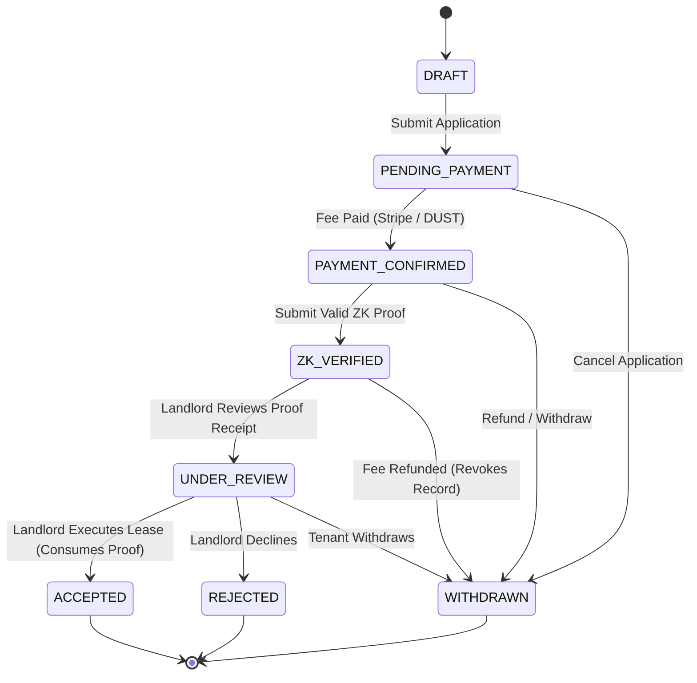

# ZkRent — System Architecture

ZkRent is a privacy-first rental application and qualification platform built on the **Midnight Network**. It enables prospective tenants to mathematically prove they satisfy a landlord's financial and background eligibility requirements without revealing sensitive documents (W-2s, tax returns, bank statements, SSNs) or raw numbers to the landlord or application backend.

---

## 1. System Overview & Component Topology

```mermaid
flowchart TB
    subgraph Client ["Tenant Browser (Edge Device)"]
        OCR["On-Device OCR (Tesseract.js)"]
        Parser["Income & Credit Parser"]
        Witness["Witness Provider (witnesses.ts)"]
        Prover["Client-Side Prover Engine (zk.ts)"]
        Connector["Lace DApp Connector / Demo Keypair"]
    end

    subgraph AppServer ["Next.js Fullstack Server"]
        API["API Route Handlers (/api/*)"]
        StateMachine["Canonical State Machine (lifecycle.ts)"]
        RateLimiter["Security Sliding Window Limiter"]
        Storage["Sharp Image Sanitizer & Media Storage"]
        Prisma["Prisma ORM (PostgreSQL)"]
    end

    subgraph MidnightInfra ["Midnight Network Infrastructure"]
        ProofServer["Proof Server (k=10 ZK Compiler)"]
        NodeRPC["Midnight Node RPC (Substrate)"]
        Indexer["Midnight GraphQL Indexer"]
        Contract["Compact Smart Contract (qualification.compact)"]
    end

    subgraph External ["External Services"]
        Stripe["Stripe Checkout & Webhooks"]
    end

    OCR --> Parser --> Witness --> Prover
    Prover -->|Prove Request (Zero Raw Data)| ProofServer
    ProofServer -->|Proof Object & Commitment| Prover
    Connector -->|Sign & Submit TX| NodeRPC
    NodeRPC --> Contract
    NodeRPC --> Indexer

    Prover -->|Cryptographic Receipt (No Raw Data)| API
    API --> RateLimiter --> StateMachine --> Prisma
    API --> Storage
    API -->|Query Ledger State| Indexer
    Stripe -->|Idempotent Webhook| API
```

---

## 2. Core Subsystems

### 2.1 On-Device Private Witness Pipeline
The tenant's physical device is the absolute trust boundary for private financial information:
1. **Document Inspection**: Financial documents (pay stubs, bank statements) are dropped into the browser.
2. **On-Device OCR**: `tesseract.js` extracts text in a browser Web Worker. Files **never** upload to the server.
3. **Regex Extraction**: Financial figures (gross income, employer tenure) are extracted into private variables in memory.
4. **Witness Structuring**: Private witnesses are structured into `TenantWitnessInput`:
   - `annualIncome: Uint<64>`
   - `backgroundClean: Boolean`
   - `creditScore: Uint<16>`
   - `employmentMonths: Uint<16>`
   - `tenantSecret: Bytes<32>`
   - `tenantSalt: Bytes<32>`

### 2.2 Midnight Zero-Knowledge Proving Engine
The proving engine operates in two distinct, non-ambiguous modes:
- **Live Mode**:
  - Pure circuits evaluate private witnesses against public listing criteria.
  - Generates zero-knowledge SNARK proof via the Midnight Proof Server.
  - Submits public inputs (`criteriaHash`, `nullifier`, `tenantCommitment`, `tier`) to Midnight devnet/testnet.
  - If infrastructure is offline, **fails loudly with HTTP 503** (never silently falls back).
- **Simulation Mode**:
  - Deterministically evaluates Compact arithmetic and circuit assertions client-side.
  - Emits simulated proofs with audit flags permanently stamped (`isSimulation = true`, status `SIMULATED`).
  - Strict server-side security barriers ensure simulated proofs **can never** transition to on-chain `VERIFIED`.

### 2.3 Midnight Smart Contract (`contracts/qualification.compact`)
The on-chain Compact contract enforces qualification logic, anti-replay rules, and application lifecycle:
- **Listing Criteria Registration**: Landlord anchors criteria on-chain, producing a canonical 12-field `criteriaHash`.
- **Proof Verification**: Asserts that income and background satisfy requirements using division-free arithmetic:
  $$\text{monthlyRent} \times 120000 \le \text{annualIncome} \times \text{maxRentToIncomeRatioBps}$$
- **Anti-Replay Nullifiers**: Prevents reusing a single qualification across listings by inserting `persistentHash(["zkrent:null:", tenantSecret, listingId])` into an on-chain set.
- **Anti-Squatting Commitments**: Locks applications to a tenant-controlled commitment `persistentHash(["zkrent:tenant:", applicationId, tenantSalt])`.
- **Qualification Lifecycle**: Transitions records from `Active` $\to$ `Consumed` (upon lease signing) or `Revoked` (upon fee refund).

---

## 3. Canonical Application State Machine



### Decoupled Sub-States:
1. **Reveal Consent State**: `NOT_REQUESTED` $\to$ `REQUESTED` $\to$ `GRANTED` / `DECLINED`
2. **On-Chain Qualification State**: `ACTIVE` $\to$ `CONSUMED` (lease signed) / `REVOKED` (refunded) / `EXPIRED` (30 days)

---

## 4. Trust Boundaries & Privacy Enforcement

| Layer | Raw Income Disclosed? | Legal Identity Disclosed? | Proof Verifiable? |
| :--- | :---: | :---: | :---: |
| **Tenant Device** | YES (in memory) | YES | YES |
| **Next.js Server** | **NO (HTTP 403 on upload)** | YES (for tenant account only) | YES (receipt metadata) |
| **Landlord View (Initial)** | **NO** | **NO (Anonymous handle: Applicant 8492)** | YES (criteria hash, nullifier, tier) |
| **Landlord View (Consented)** | **NO** | **YES (Tenant opted in)** | YES (active qualification) |
| **Midnight On-Chain State** | **NO (Zero-Knowledge)** | **NO (Commitment hashes)** | **YES (Cryptographically Proven)** |
