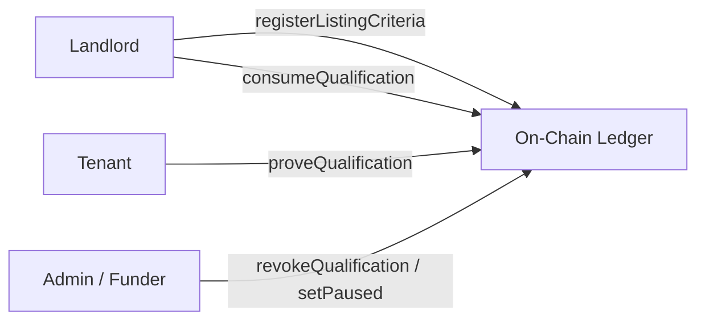

# ZkRent — Smart Contract Reference (`qualification.compact`)

The ZkRent smart contract is written in **Compact** (the domain-specific language for the Midnight Network) and compiled to Zero-Knowledge Intermediate Representation (ZKIR) and cryptographic proving keys.

---

## 1. Contract Overview

- **Source File**: `contracts/qualification.compact`
- **Managed Output**: `contracts/managed/qualification/`
- **Compiler Version**: Compact v0.5.3 (Language 0.26.0, Ledger 9.1.0-rc.3)
- **Constraint Profile**: **272 measured ZKIR instructions** across 5 circuits



---

## 2. On-Chain Ledger Declarations

```compact
export ledger listingCriteria: Map<Bytes<32>, ListingCriteria>;
export ledger qualifications: Map<Bytes<32>, QualificationRecord>;
export ledger usedNullifiers: Set<Bytes<32>>;
export ledger isPaused: Boolean;
export ledger admin: Bytes<32>;
```

### Data Structures

#### `ListingCriteria`
Holds landlord-defined qualification criteria anchored on-chain:
- `criteriaHash: Bytes<32>`: 12-field canonical hash.
- `landlordPk: Bytes<32>`: Landlord verification public key.
- `version: Uint<32>`: Incremental criteria revision number.
- `active: Boolean`: Whether listing accepts applications.
- `monthlyRent: Uint<64>`: Monthly rent in USD/cents.
- `minIncomeReq: Uint<64>`: Minimum gross annual income.
- `maxRentToIncomeRatioBps: Uint<16>`: Maximum rent-to-income ratio (basis points, e.g., 3300 = 33%).
- `minCreditScore: Uint<16>`: Minimum credit score (e.g., 650).
- `minEmploymentMonths: Uint<16>`: Minimum employment tenure in months.
- `requireCleanBackground: Boolean`: Whether clean background check is required.
- `primeMaxRentToIncomeRatioBps: Uint<16>`: Prime tier maximum ratio (e.g., 2500 = 25%).
- `primeMinCreditScore: Uint<16>`: Prime tier minimum credit score (e.g., 750).

#### `QualificationRecord`
Holds public proof verification state for an application:
- `applicationId: Bytes<32>`: Application identifier.
- `tenantCommitment: Bytes<32>`: Anti-squatting commitment `hash(["zkrent:tenant:", applicationId, salt])`.
- `criteriaHash: Bytes<32>`: Exact listing criteria hash proven against.
- `tier: Uint<8>`: Coarse qualification tier (`0` = Standard, `1` = Prime).
- `verifiedAt: Uint<64>`: On-chain timestamp when verified.
- `expiresAt: Uint<64>`: Verification expiration timestamp (typically 30 days).
- `lifecycle: Uint<8>`: `0` = Active, `1` = Consumed, `2` = Revoked, `3` = Expired.

---

## 3. The 5 Circuits

### 3.1 `registerListingCriteria(listingId: Bytes<32>, criteria: ListingCriteria)`
Anchors or updates criteria for a property listing.
- **Access Control**: Asserts caller owns the listing (`criteria.landlordPk == caller`).
- **Invariants**: Computes and binds the canonical 12-field criteria hash. Increments `version`.

### 3.2 `proveQualification(listingId: Bytes<32>, applicationId: Bytes<32>, currentChainTime: Uint<64>)`
Verifies tenant eligibility in zero-knowledge.
- **Private Witnesses**:
  - `attestation: AttestationPayload`: Income, background, credit score, tenure, issued timestamp.
  - `tenantSecret: Bytes<32>`: Tenant private secret.
  - `tenantSalt: Bytes<32>`: Tenant commitment salt.
- **Mathematical Invariants**:
  1. **Division-Free Income Assertion**:
     $$\text{monthlyRent} \times 120000 \le \text{annualIncome} \times \text{maxRentToIncomeRatioBps}$$
  2. **Background & Credit Assertion**:
     `backgroundClean == true` AND `creditScore >= minCreditScore` AND `employmentMonths >= minEmploymentMonths`.
  3. **Tier Determination**:
     If $\text{monthlyRent} \times 120000 \le \text{annualIncome} \times \text{primeMaxRentToIncomeRatioBps}$ AND $\text{creditScore} \ge \text{primeMinCreditScore}$, outputs **Prime Tier (1)**; else **Standard Tier (0)**.
  4. **Anti-Replay Nullifier**:
     Calculates $\text{nullifier} = \text{persistentHash}([\text{"zkrent:null:"}, \text{tenantSecret}, \text{listingId}])$. Asserts $\text{nullifier} \notin \text{usedNullifiers}$, then inserts it into `usedNullifiers`.
  5. **Anti-Squatting Commitment**:
     Asserts $\text{tenantCommitment} == \text{persistentHash}([\text{"zkrent:tenant:"}, \text{applicationId}, \text{tenantSalt}])$.

### 3.3 `consumeQualification(applicationId: Bytes<32>)`
Invoked when a landlord and tenant finalize a lease.
- **Access Control**: Landlord of listing or tenant.
- **Lifecycle Transition**: Updates record from `Active` (0) $\to$ `Consumed` (1).
- **Security**: Prevents a tenant from reusing the qualification on subsequent applications.

### 3.4 `revokeQualification(applicationId: Bytes<32>)`
Invoked upon application cancellation or application fee refund.
- **Access Control**: Landlord, tenant, or contract admin.
- **Lifecycle Transition**: Updates record to `Revoked` (2).

### 3.5 `setPaused(paused: Boolean)`
Emergency administrative pause switch.
- **Access Control**: Admin key only (`admin == caller`).
- **Effect**: Halts new proof verification while pause is active.

---

## 4. Canonical 12-Field Criteria Hash Definition

To ensure that landlords cannot change requirements after a tenant proves qualification, every proof is cryptographically tied to the exact criteria hash:

```typescript
criteriaHash = sha256(
  encodePacked([
    listingId,                    // Bytes<32>
    minIncomeReq,                 // Uint<64>
    maxRentToIncomeRatioBps,      // Uint<16>
    minCreditScore,               // Uint<16>
    minEmploymentMonths,          // Uint<16>
    requireCleanBackground,       // Boolean
    primeMaxRentToIncomeRatioBps, // Uint<16>
    primeMinCreditScore,          // Uint<16>
    landlordPk,                   // Bytes<32>
    version,                      // Uint<32>
    active,                       // Boolean
    monthlyRent,                  // Uint<64>
  ])
);
```

Mathematical equivalence between TypeScript and Compact hashing is verified in `scripts/test-contract-circuits.ts`.

---

## 5. Toolchain Operations

### Compile Contract
```bash
npm run compact:compile
```
Compiles `contracts/qualification.compact` into `contracts/managed/qualification/`, generating TypeScript interfaces, circuits runtime, ZKIR binaries, and proving/verification keys.

### Run Contract Tests (T1–T8)
```bash
node node_modules/tsx/dist/cli.mjs scripts/test-contract-circuits.ts
```

### Deploy Contract
```bash
# Dry run verification of compiled keys and interfaces
npm run deploy:dry-run

# Deploy to local devnet
npm run deploy:local

# Deploy to Midnight Preprod Testnet
npm run deploy:preprod
```
