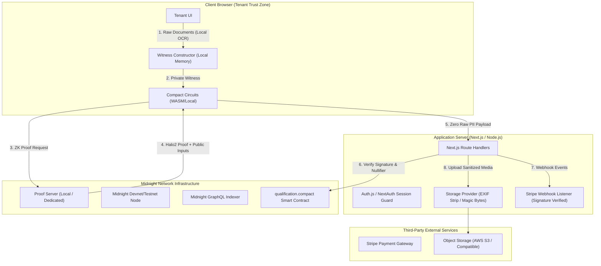

# ZkRent Security Architecture & Threat Model

**Status**: Active  
**Version**: 1.0.0 (Phase 4 Hardening)  
**Last Updated**: October 2026  

---

## 1. Executive Summary

ZkRent is a zero-knowledge tenant qualification protocol built on the **Midnight Network**. Its primary security objective is to allow prospective tenants to prove creditworthiness, income sufficiency, and background clearance to landlords **without disclosing raw financial records, account balances, tax returns, social security numbers, or employer details**.

This document outlines the system threat model, trust boundaries, PII protections, cryptographic guarantees, and operational hardening standards implemented across the stack.

---

## 2. System Actors & Trust Boundaries

### Trust Boundary Definitions

| Boundary | Zone | Assumptions & Threats |
| :--- | :--- | :--- |
| **Zone 1: Tenant Browser** | Fully Trusted for Tenant PII | Private financial data resides only in browser memory during OCR and witness generation. Sensitive state is never persisted to localStorage or sent to the server. |
| **Zone 2: Application Server** | Semi-Trusted Orchestrator | Server coordinates database state, authentication, and file routing. The server is **blind** to tenant raw income and tax documents. All API endpoints enforce strict object-level authorization (IDOR protection). |
| **Zone 3: Proof Server** | Prover Execution Environment | In tenant-local mode or secure enclave, the proof server synthesizes cryptographic proofs from witnesses. Private witness data is destroyed immediately after proof generation and is never logged. |
| **Zone 4: Midnight Ledger** | Public Distributed Ledger | Midnight smart contract stores public commitments: criteria hashes, nullifiers, and eligibility seals. Zero PII is committed to the blockchain. |
| **Zone 5: Landlord Portal** | Untrusted by Tenant | Landlords have access only to mathematical eligibility outcomes (`ELIGIBLE`, `Prime Tier`) and anonymous applicant identifiers (`Applicant #8492`) until explicit two-phase consent is granted. |

---

## 3. Threat Model & Mitigations

### T1: Raw Income or Financial Data Leakage to Server
* **Threat**: A compromised server, malicious administrator, or intercepted HTTP request reveals tenant paystubs, W-2s, or bank account balances.
* **Mitigation**:
  - The client runs document parsing (OCR) and witness derivation entirely within the user's browser.
  - The verification endpoint [`POST /api/verifications/prove`](file:///c:/Users/akram/Desktop/zkren/midnighthack/zkrent/src/app/api/verifications/prove/route.ts) accepts only `{ applicationId, proofResult }`, containing zero financial integers.
  - In legacy fallback mode, raw credentials emit high-severity server security warnings (`[ZkRent-Security] Warning: Raw credentials received over HTTP`).

### T2: Cross-Listing Tenant Tracking & Correlation
* **Threat**: A landlord owning multiple properties inspects applications across different units and correlates applicant UUIDs or email addresses to de-anonymize tenants without their consent.
* **Mitigation**:
  - All landlord application lists and query endpoints shape responses dynamically based on `revealStatus === 'GRANTED'`.
  - When consent is not granted, `tenantId`, `tenantEmail`, `tenantPhone`, and `tenantName` are completely suppressed from the API payload (replaced with `Applicant <applicantDisplayId>`).
  - `applicantDisplayId` is derived per-application, ensuring un-linkability across multiple listings.

### T3: Forged Client-Side Proofs
* **Threat**: A malicious tenant intercepts client JavaScript and crafts a forged `{ isEligible: true, tier: 1 }` payload to qualify for luxury properties fraudulently.
* **Mitigation**:
  - In **Live Mode**, the server and smart contract verify the cryptographic Halo2 proof against the Midnight node/indexer and check criteria hash versioning.
  - In **Simulation Mode**, the server strictly validates:
    1. `criteriaHash` binding against the property's configured rules.
    2. Nullifier length and cryptographic format (`zk_null_` 32-byte digest).
    3. Mandatory payment receipt (`paymentStatus === 'PAID'`).
    4. Anti-replay nullifier uniqueness against all previous applications.
  - Prover mode is strictly controlled via `MIDNIGHT_PROVER_MODE`. If `"live"` is configured and devnet is offline, requests **fail loudly** rather than falling back silently.

### T4: Nullifier Replay & Application Squatting
* **Threat**: A tenant reuses a single qualifying proof across multiple listings, or a third party steals a proof hash to apply on behalf of a tenant.
* **Mitigation**:
  - Contract circuit derives nullifiers bound to both listing identity and attestation timestamp:
    $$\text{nullifier} = \text{persistentHash}([\text{"zkrent:null:"}, \text{tenantSecret}, \text{listingId}, \text{issuedAt}])$$
  - Anti-squatting constraint binds `tenantCommitment = persistentHash(["zkrent:tenant:", tenantSecret, applicationId])`.
  - Anti-replay check in [`src/app/api/verifications/prove/route.ts`](file:///c:/Users/akram/Desktop/zkren/midnighthack/zkrent/src/app/api/verifications/prove/route.ts#L199-L215) queries database for identical active nullifiers and rejects with `409 Conflict`.

### T5: Unauthorized File Uploads & Metadata Leaks
* **Threat**: An attacker uploads malicious PHP/SVG scripts, oversized files, or images containing sensitive location metadata (EXIF GPS tags) via listing photo uploads.
* **Mitigation**:
  - Storage provider abstraction ([`src/lib/storage/index.ts`](file:///c:/Users/akram/Desktop/zkren/midnighthack/zkrent/src/lib/storage/index.ts)) inspects the first 12 bytes of uploaded buffers for magic byte signatures (`JPEG: FF D8 FF`, `PNG: 89 50 4E 47`, `WebP: RIFF....WEBP`). Mismatched MIME claims are immediately rejected.
  - Image buffers undergo automatic EXIF stripping using binary APP1 segment pruning (`0xFF 0xE1`), removing camera models, timestamps, and GPS coordinates.
  - All filenames are replaced with cryptographic UUIDv4 identifiers, preventing path traversal attacks.
  - File size is strictly enforced at $\le 5\text{MB}$.
  - Storage provider is decoupled with concrete implementations for `LocalStorageProvider` and `S3StorageProvider`.

### T6: Webhook Replay & Stripe Payment Tampering
* **Threat**: An attacker intercepts Stripe callbacks, replays payment success events, or alters order states without completing checkout.
* **Mitigation**:
  - Stripe webhook handler ([`src/app/api/payments/webhook/route.ts`](file:///c:/Users/akram/Desktop/zkren/midnighthack/zkrent/src/app/api/payments/webhook/route.ts)) constructs events via `stripe.webhooks.constructEvent(body, signature, secret)`.
  - Idempotency guard checks whether the payment transaction is already marked `PAID`.
  - Event-ordering safety prevents late `checkout.session.completed` events from downgrading applications already in `VERIFYING` or `ZK_VERIFIED`.
  - `charge.refunded` events transition payments to `REFUNDED` and automatically withdraw active applications (`WITHDRAWN`).

### T7: Accidental or Malicious Database Wipe via Demo Reset
* **Threat**: An attacker or search crawler calls `POST /api/demo/reset` in production to wipe properties and verification records.
* **Mitigation**:
  - Route handler ([`src/app/api/demo/reset/route.ts`](file:///c:/Users/akram/Desktop/zkren/midnighthack/zkrent/src/app/api/demo/reset/route.ts)) checks `ENABLE_DEMO_RESET === 'true'` and verifies `NODE_ENV !== 'production'`. In any production or unflagged deployment, it returns `404 Not Found`.
  - In-memory rate limiter restricts reset invocations to **1 request per 60 seconds** per client IP.

---

## 4. Consent Lifecycle (Identity Reveal)

To balance landlord diligence with tenant privacy, ZkRent implements a formal **Two-Phase Consent Protocol**:

1. **State: `NONE`**: Tenant submits application. Landlord sees only `Applicant #8492` and `ELIGIBLE: Prime Tier`.
2. **State: `REQUESTED`**: Landlord reviews qualifying zero-knowledge proof and requests full identity details to draft a lease.
3. **State: `GRANTED`**: Tenant receives an in-app notification and explicitly signs consent. Server unlocks `displayName`, `email`, and `phone` to the landlord, and transitions status to `LEASE_OFFERED`.
4. **State: `DECLINED`**: Tenant declines reveal request. Identity remains sealed; application may be withdrawn.

---

## 5. Security Checklist for Production Deployment

- [x] Native Compact contract circuits compiled via `compact compile`.
- [x] Division-free integer arithmetic for all ratios and thresholds.
- [x] Explicit prover mode configuration (`MIDNIGHT_PROVER_MODE`) without silent fallbacks.
- [x] Bech32m address formatting (`mn_addr1...`) and standard token denominations (`tNIGHT` / `DUST`).
- [x] Magic-byte validation and EXIF metadata stripping on all media uploads.
- [x] Cryptographic UUIDv4 media paths served via controlled streaming route (`/api/media/[filename]`).
- [x] Stripe webhook HMAC SHA256 signature verification and idempotency guards.
- [x] Demo reset endpoint gated and rate-limited.
- [x] Object-level access control on all application and property endpoints.
- [x] Real compiled Compact runtime test suite passing all test cases.
