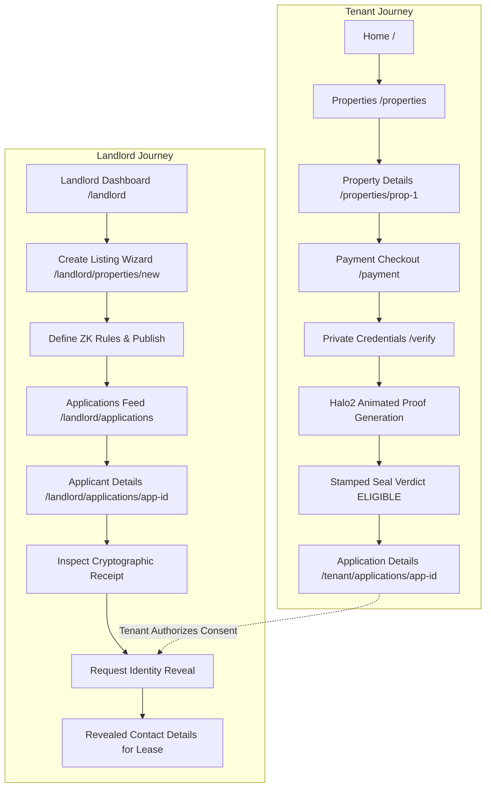

# ZkRent — Zero-Knowledge Rental Marketplace Walkthrough

ZkRent is a privacy-first rental marketplace where tenants prove they meet landlord eligibility requirements (income, background check, employment) using **zero-knowledge proofs on the Midnight Network**—instead of uploading pay stubs, bank statements, or tax returns.

---

## 🎨 Design System & Visual Tokens

The user interface implements the dual-mode design system:
- **Marketplace Mode** (Browsing, listings, dashboards): Editorial paper-and-ink aesthetic using `ledger` (`#EDECE4`), `ink` (`#14213D`), and fixture `brass` (`#AE8B3F`).
- **Verification Mode** (`/tenant/applications/[applicationId]/verify`): Precision darkroom feel using `ink` (`#14213D`), high-contrast `proof-teal-bright` (`#4FB3A5`), `proof-teal` (`#2E7D74`), and `redaction` (`#17181A`).
- **Signature Stamped Seal & Redaction Motifs**: Sensitive fields redact behind solid black witness bars, and successful evaluations stamp with a brass-ring, rotation-snap landing "ELIGIBLE" seal.

---

## 🚀 End-to-End User Journeys

---

## 📋 Comprehensive 26+ Screen Reference

### Public / Marketplace
1. **Home (`/`)**: Editorial hero, interactive concept visualizer, featured properties with visible ZK badges, why ZkRent, 4-step workflow, and tenant/landlord CTAs.
2. **Property Search (`/properties`)**: Search by location/keyword, multi-criteria filters (property type, bedrooms, max rent slider, max ZK income requirement, background toggle, employment toggle), sort dropdown, and upfront ZK requirement pills.
3. **Property Details (`/properties/[propertyId]`)**: Photo gallery with thumbnail picker, specs, amenities, description, and sticky sidebar with explicit ZK requirements and "Apply with Midnight Proof" CTA.
4. **How It Works (`/how-it-works`)**: Traditional document-sharing vs. ZkRent on Midnight comparison, 5-step lifecycle, and cryptography explanation.
5. **About (`/about`)**: Mission, privacy problem in renting, and Midnight Network principles.

### Tenant Portal
6. **Tenant Dashboard (`/tenant`)**: Greeting, active applications feed with live status pills, quick action links, and persistent privacy pledge.
7. **Tenant Applications List (`/tenant/applications`)**: Filter tabs (`All`, `Verified Eligible`, `Pending`, `Rejected`) and detailed application cards.
8. **Application Details (`/tenant/applications/[applicationId]`)**: 4-stage lifecycle checklist, stamped verdict seal, inspectable proof receipt, and the **Tenant Consent Prompt** for lease drafting.
9. **Payment (`/tenant/applications/[applicationId]/payment`)**: Verification fee checkout ($5.00), credit card vs. Midnight DUST wallet toggle, and "what happens next" guide.
10. **ZK Verification Hero Screen (`/tenant/applications/[applicationId]/verify`)**:
    - *State 1*: Requirements recap & on-device privacy guarantee.
    - *State 2*: Private credentials entry with explicit on-device framing.
    - *State 3*: Flagship proof generation animation (redaction bars $\to$ 38,420 Halo2 constraints $\to$ SNARK synthesis $\to$ Midnight Network).
    - *State 4*: Stamped Seal verdict ("ELIGIBLE"), confetti burst, requirement pass/fail breakdown, and Midnight tx hash.
11. **Proof Vault / Verification History (`/tenant/verification`)**: Past cryptographic receipts with timestamps, constraints, and audit drawers.
12. **Single Proof Receipt (`/tenant/verification/[applicationId]`)**: Fullscreen inspectable verification receipt with block height and merkle root.
13. **Tenant Settings (`/tenant/settings`)**: Profile, connected Midnight wallet (`mn_addr1q8f...`), prover privacy preferences, and security sessions.

### Landlord Portal
14. **Landlord Dashboard (`/landlord`)**: Stat tiles (Active Properties, Applications, Verified), "+ Create Free Listing" CTA, and recent anonymized applications feed (`#A81F` with zero raw figures).
15. **Landlord Properties List (`/landlord/properties`)**: Portfolio grid with rent, application count, published status, and manage buttons.
16. **Create Property Wizard (`/landlord/properties/new`)**: 4-step wizard: Basic info $\to$ Photos & Amenities $\to$ ZK Qualification Rules $\to$ Review & Publish (100% Free).
17. **Property Management (`/landlord/properties/[propertyId]`)**: Application funnel (Total, Eligible, Pending, Rejected), edit property & requirements links, and listing applicant feed.
18. **Edit Property (`/landlord/properties/[propertyId]/edit`)**: Pre-filled property edit form.
19. **Edit Requirements (`/landlord/properties/[propertyId]/requirements`)**: ZK qualification threshold slider, background toggle, and employment toggle.
20. **Landlord Applications List (`/landlord/applications`)**: Filterable applicant inquiries with anonymized IDs and ZK badges only.
21. **Landlord Applicant Details (`/landlord/applications/[applicationId]`)**:
    - Anonymized ID `#A81F` and Stamped Seal verdict.
    - Strict privacy guarantee: **No raw income or credentials are ever shown**.
    - Expandable **"Verify Receipt"** panel surfacing Midnight tx hash, circuit reference, block height, and verified parameter outcomes.
    - **"Move Forward with this Applicant"** action that dispatches an identity reveal request to the tenant, updating in-place once consented.
22. **Landlord Settings (`/landlord/settings`)**: Business entity profile, application notification preferences, and session diagnostics.

### Auth & Supporting Stub Pages
23. **Login (`/login`)**: 1-click demo login buttons for Tenant and Landlord modes, plus email sign-in.
24. **Register (`/register`)**: Role selector (Tenant / Landlord) with instant onboarding redirect.
25. **Onboarding (`/onboarding`)**: Role-specific interactive welcome tours.
26. **Payment Success (`/payment/success`)**: Paid confirmation with "Continue to ZK Prover" action.
27. **Payment Cancelled (`/payment/cancelled`)**: Recovery page with retry payment option.

---

## 🔒 Verification & Privacy Compliance

- **Build Status**: Verified with `npm run build` (`26/26` pages generated successfully with zero TypeScript or route errors).
- **Hard Privacy Rule**: Verified that no raw salary amounts, tax documents, or employer names render anywhere on the landlord side.
- **Inspectability**: Skeptical landlords can expand the "Verify Receipt" drawer to verify Midnight smart contract transaction hashes (`0x7a8f...`) and circuit IDs without compromising tenant privacy.
- **State Persistence**: State is stored reactively in `ZkRentContext` with LocalStorage backing and a one-click "Reset Demo State" button in the utility bar.
